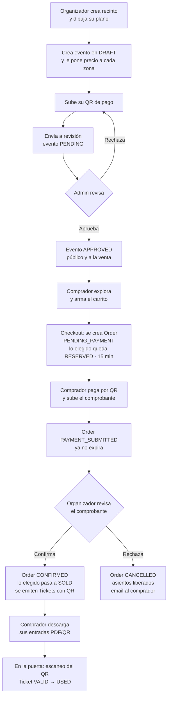
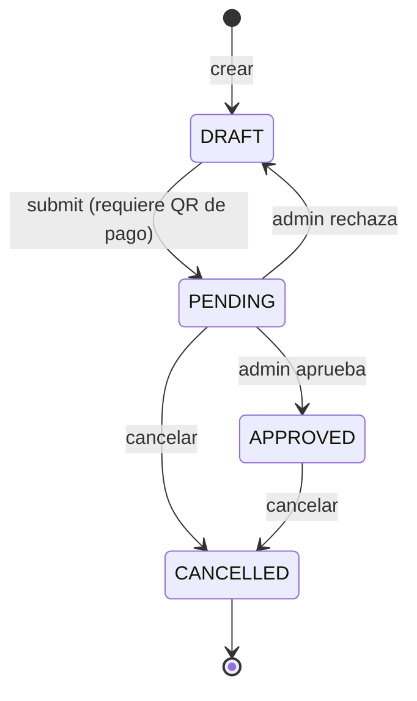
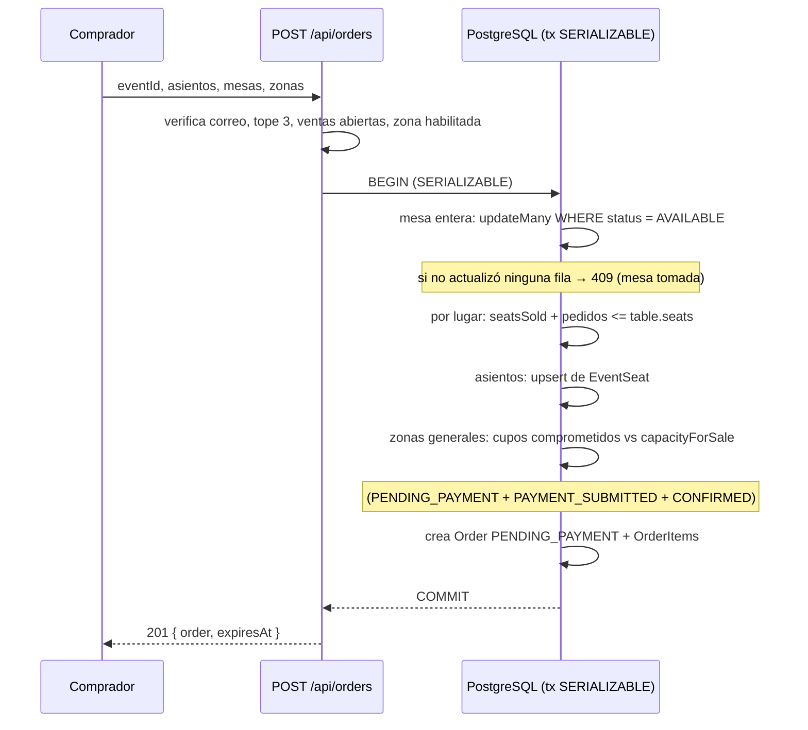
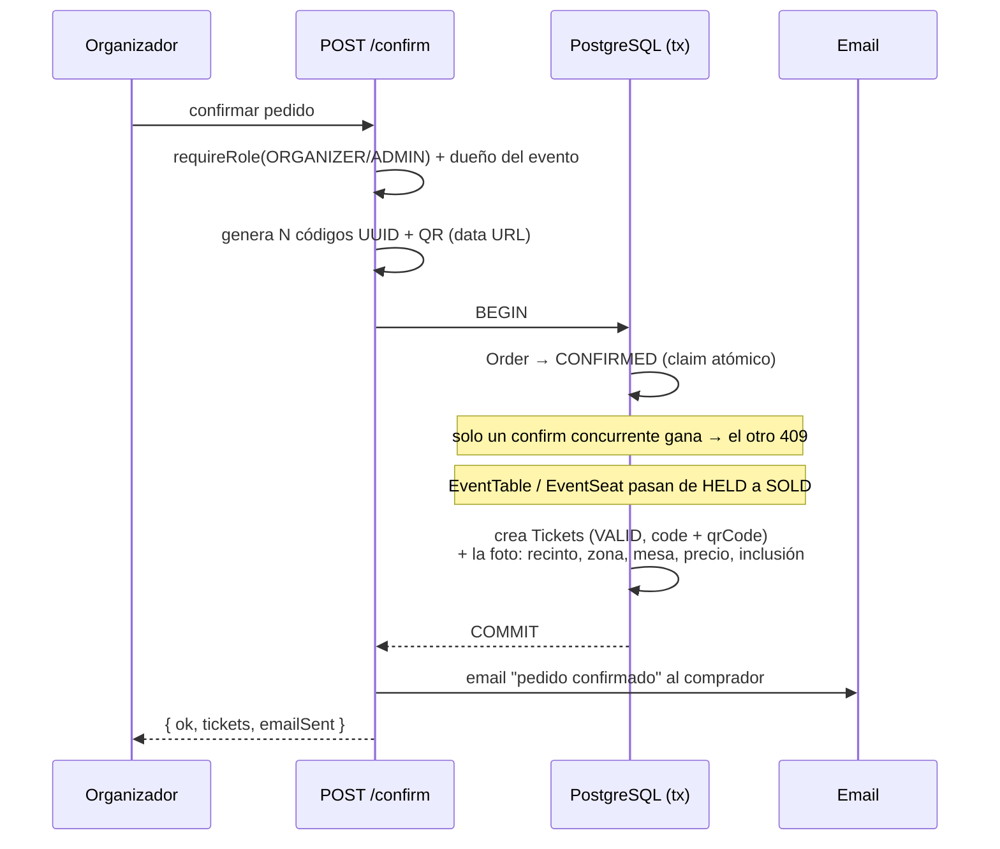
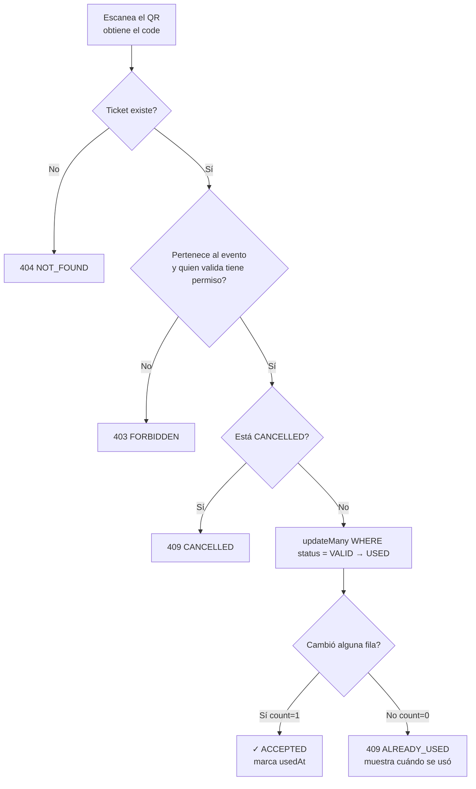

# Üticket — Cómo funciona la plataforma

> Documento de referencia integral. Explica, de punta a punta, qué es Üticket, quién
> la usa, cómo están organizados los datos y cómo fluye cada operación (registro,
> creación de eventos, compra, pago, confirmación y control en puerta). Está pensado
> para que **cualquier persona** —técnica o no— entienda cómo opera el sistema.
>
> Última actualización: **2026-08-28**, tras separar la capa física del recinto de la
> capa comercial de cada evento (§4) y sumar el editor de planos, la pantalla de precios
> y los dos mapas.

---

## 1. ¿Qué es Üticket?

**Üticket** (antes *BoletaVIP*) es una **plataforma de venta de entradas para eventos**
pensada para el contexto de **Bolivia**. Su particularidad frente a plataformas
grandes es que **no integra una pasarela de pago automática**: usa el método de pago
más común y confiable del país, la **transferencia por QR bancario**.

El modelo de pago es **manual y verificado por humanos**:

1. El comprador arma su pedido y la plataforma le muestra el **QR bancario estático**
   del organizador.
2. El comprador paga desde su app bancaria y **sube una foto del comprobante**.
3. El **organizador revisa el comprobante** y confirma (o rechaza) el pago.
4. Al confirmar, se **emiten las entradas** con un **código QR único** cada una.
5. En la puerta del evento, ese QR se **valida con el escáner de la app** y se marca
   como usado (sirve una sola vez).

> **Lema:** *"Tu entrada en un clic."* — Tono de marca: cercano, claro y emocionante.

### El problema que resuelve

Convierte un proceso informal (pagar por QR y mandar el comprobante por WhatsApp) en
un flujo **ordenado, auditable y con entradas válidas antifraude**, sin exigir que el
organizador tenga contratos con pasarelas de pago ni dominios propios.

---

## 2. Actores y roles

Hay **tres roles** en la base de datos (`Role`) más un cuarto actor sin cuenta:

| Actor | Rol | Qué hace |
|-------|-----|----------|
| **Comprador** | `BUYER` | Explora eventos, arma el carrito, compra, sube comprobantes y descarga sus entradas. Es el rol por defecto al registrarse. |
| **Organizador** | `ORGANIZER` | Crea recintos (venues) y eventos, sube su QR de pago, revisa y confirma pagos, ve compradores, controla la puerta. |
| **Administrador** | `ADMIN` | Aprueba/rechaza eventos, suspende usuarios, ajusta la configuración global. **Solo se crea desde la base de datos.** |
| **Personal de puerta** | *(sin cuenta)* | Valida entradas en el ingreso usando un **código de escaneo** del evento, sin necesidad de iniciar sesión. |

Notas de roles:
- Al registrarse, el usuario elige entre **comprador** u **organizador**.
- Un comprador puede **auto-promoverse a organizador** en cualquier momento
  (`POST /api/organizer/upgrade`) — mismo nivel de confianza que elegirlo al registrarse.
- El `ADMIN` **hereda todos los permisos** de organizador (puede tocar recursos de
  cualquiera). Los organizadores solo tocan **lo suyo**.

---

## 3. Panorama técnico (stack)

| Capa | Tecnología | Notas relevantes |
|------|-----------|------------------|
| **Framework** | **Next.js 16** (App Router) | Protección de rutas en `src/proxy.ts` (no `middleware.ts`). `params`/`searchParams` son *Promises*. |
| **Lenguaje** | TypeScript + React 19 | |
| **Base de datos** | **PostgreSQL** vía **Prisma 7** | Cliente generado a `src/generated/prisma`. La URL vive en `prisma.config.ts`, no en el schema. Adaptador `PrismaPg`. |
| **Autenticación** | **NextAuth v5 (beta)** | Estrategia **JWT**; `id` y `role` inyectados en la sesión. Credenciales + Google (opcional). |
| **Estilos** | **Tailwind v4** | Tokens en `globals.css` con variables CSS; dark mode por clase (`next-themes`). |
| **Estado cliente** | **Zustand** | Solo para el carrito (persistido en `localStorage`). |
| **Validación** | **Zod** | Todos los cuerpos de las mutaciones se validan con esquemas en `src/lib/validations/*`. |
| **Archivos** | **Vercel Blob** | Imágenes públicas (portadas, QR) y comprobantes privados en stores separados. |
| **QR / PDF** | `qrcode`, `pdf-lib`, `jsqr` | Generar QR de entradas, PDF descargable y leer QR con la cámara. |
| **Emails** | `fetch` directo (sin SDK) | Brevo o Resend según variables de entorno; en local, a consola. |
| **Deploy** | **Vercel + Neon + Vercel Blob** | Push a `main` = deploy automático. |

### Principios de arquitectura

- **Las mutaciones** pasan por rutas `/app/api/**` con validación Zod.
- **Las lecturas** ocurren directo en *server components* con `prisma` (sin API intermedia).
- **Los precios se calculan SIEMPRE en el servidor**: salen de `EventZone.price` (en Bs
  absolutos, sin multiplicadores), con override opcional por mesa o asiento. El cliente
  nunca fija un precio.
- **Dos capas que no se mezclan**: la *física* (dónde están las cosas) y la *comercial*
  (qué se vende y a cuánto). Ver §4.
- **El dinero** son campos `Decimal`; se convierten con `Number()` antes de pasarlos a componentes cliente.
- **Sin websockets**: la frescura de datos se logra con *refresh* al enfocar la pestaña,
  polling en la vista de pedidos del organizador y `staleTimes.dynamic: 0`.
- **Expiración perezosa + una red de seguridad**: expirar pedidos corre **de forma
  perezosa** antes de leer/escribir pedidos, y además un Vercel Cron
  (`vercel.json` → `GET /api/cron/expire-orders`, protegido con `CRON_SECRET`) libera
  los cupos abandonados aunque nadie esté navegando. El cron corre **una vez por día**:
  el proyecto está en plan Hobby de Vercel, que no admite mayor frecuencia (un `*/5`
  hace fallar el deploy entero).

---

## 4. Modelo de datos

Entidades principales (`prisma/schema.prisma`). El modelo está partido en **dos capas
que nunca se mezclan**, porque cambian a ritmos distintos:

```
CAPA FÍSICA  (geometría pura · se define una vez · la reusan todos los eventos)
  Venue ──< Floor ──< Zone ──< Table          (zona de mesas)
                          └──< Seat           (zona numerada)
        sin precios, sin estados, nunca

CAPA COMERCIAL  (precios y disponibilidad · se rehace por evento)
  Event ──< EventZone ──< EventTable          (creadas junto con la zona)
                    └──< EventSeat            (creadas solo cuando hacen falta)

  Order ──< OrderItem ──> EventZone | EventTable | EventSeat
        └──< Ticket ────> ídem, + una FOTO de dónde y a cuánto se compró
```

| Modelo | Para qué sirve | Detalles clave |
|--------|----------------|----------------|
| **User** | Cuenta (comprador/organizador/admin). | `emailVerified`, `suspended`, `phone` (WhatsApp del organizador), `password` (hash bcrypt). |
| **Account / Session** | Tablas del adaptador de NextAuth (para Google/OAuth). | La sesión real es JWT, no de base de datos. |
| **VerificationToken** | Tokens de verificación de correo **y** de *reset* de contraseña. | Se guarda solo el **hash SHA-256**; el prefijo `password-reset:` separa ambos flujos. |
| **PlatformSettings** | Configuración global (singleton, `id = "main"`). | `orderCutoffHours` (horas antes del evento en que cierran ventas; default 2). |
| **Venue** | Recinto físico del organizador. | Solo datos y ubicación. El aforo **no se guarda**: se deriva del plano. |
| **Floor** | Piso del recinto. Siempre hay al menos uno. | Lienzo del plano (`canvasWidth`/`canvasHeight`). La interfaz esconde los pisos cuando hay uno solo. |
| **Zone** | Sector dentro de un piso. | `type` = `GENERAL` (aforo) \| `TABLES` (contiene `Table`) \| `SEATED` (contiene `Seat`). Geometría en el lienzo. **Sin precios ni estados.** Siempre ramificar por `type`. |
| **Table** | Mesa o lounge. | `seats` = cuántas personas admite. `hasChairs` decide solo cómo se dibuja y se lee: un lounge es un sofá con aforo, no ocho sillas. **Sin precio ni estado.** |
| **Seat** | Asiento individual de una zona numerada. | **Sin estado propio.** Único por `(zona, fila, número)`. |
| **EventZone** | Una zona **puesta a la venta para un evento**. | `price` (Bs absolutos), `isEnabled`, `capacityForSale`, `tableSaleMode` (entera / por lugar), inclusiones, ventana de venta. |
| **EventTable** | Una mesa a la venta para un evento. | Se crea **junto con** su `EventZone` (las mesas vienen de a docenas). Lleva `status` y `seatsSold`, y puede pisar el precio de la zona. |
| **EventSeat** | Un asiento a la venta para un evento. | Se crea **perezosamente**: no tener fila ya significa "libre, al precio de la zona" (un teatro tiene miles). |
| **Event** | El evento en sí. | `status`, `paymentQrImage` (QR de pago), `scanCode` (acceso de puerta), fecha a **mediodía UTC**. El precio **no** vive acá. |
| **Order** | Pedido de compra de un comprador. | `status`, `totalAmount`, `paymentQrUrl` (foto del QR al momento de comprar), `paymentProof` (comprobante), `expiresAt`. |
| **OrderItem** | Línea del pedido. | Apunta a un `EventSeat` (cantidad 1), a un `EventTable` (entera: cantidad 1 · por lugar: `seatsQuantity` lugares) o a un `EventZone` general (cantidad N). Guarda el `unitPrice` pagado. |
| **Ticket** | Entrada emitida. | `code` (UUID), `qrCode`, `status` = `VALID` \| `USED` \| `CANCELLED`. Lleva una **foto** de la compra: recinto, piso, zona, mesa, asiento, precio e inclusión. Una mesa de N personas emite N entradas. |

### 4.1 La disponibilidad es por EVENTO, nunca por recinto

Un recinto se reutiliza: el mismo teatro corre el mismo plano el viernes y el sábado.
Por eso **nada de la capa física lleva estado** — si lo llevara, la venta de un evento
bloquearía todos los demás eventos del mismo lugar (fue exactamente ese el bug,
corregido el 2026-08-25).

La ocupación vive en la capa comercial, **guardada por evento** en `EventTable.status` y
`EventSeat.status`. Las zonas generales siguen contándose desde las órdenes vivas de ese
evento (`LIVE_ORDER_STATUSES` = `PENDING_PAYMENT` | `PAYMENT_SUBMITTED` | `CONFIRMED`).
Se lee con `getEventInventory()` (`src/lib/seats.ts`).

**La contrapartida:** al estar guardado, alguien tiene que devolverlo. `releaseOrderHolds()`
corre en cada lugar donde una orden deja de estar viva — expiración, cancelación del
comprador o del organizador, cascada de cancelación del evento — y `releaseExpiredHolds()`
barre los `heldUntil` vencidos como red de seguridad. Si se olvida cualquiera de los dos,
los lugares se filtran.

### Las cinco máquinas de estado

El sistema gira en torno a estados bien definidos:

- **Evento:** `DRAFT → PENDING → APPROVED` (o vuelta a `DRAFT` si se rechaza) → `CANCELLED`.
- **Pedido:** `PENDING_PAYMENT → PAYMENT_SUBMITTED → CONFIRMED` (o `CANCELLED`).
- **Entrada:** `VALID → USED` (o `CANCELLED`); `USED → VALID` dentro de la ventana
  de 2 minutos para deshacer un check-in mal escaneado.
- **Usuario:** activo ↔ `suspended`.

La disponibilidad de asientos y lounges **no** es una máquina de estado: es una
proyección de las órdenes vivas del evento (§4.1).

---

## 5. El recorrido completo (vista de pájaro)



---

## 6. Autenticación, registro y verificación de correo

### 6.1 Registro (`POST /api/register`)

1. Se valida el cuerpo con Zod (`registerSchema`).
2. Se rechaza si el correo ya existe (409).
3. Se hashea la contraseña con **bcrypt** (10 rondas).
4. Se crea el usuario con rol `BUYER` u `ORGANIZER` según `wantsOrganizer`.
5. Se envía el **correo de verificación** con un enlace `/verify-email?token=…`.

### 6.2 Verificación de correo (obligatoria para comprar)

- El token es de **un solo uso**, dura **24 h**, y en la base **solo se guarda su hash**.
- El enlace lleva a `/verify-email?token=…`, que llama a `verifyEmailToken()`:
  marca `emailVerified` y consume el token.
- Reenvío desde el aviso del layout (`POST /api/verify-email/resend`), con **cooldown de 60 s**.
- **Sin correo verificado no se puede comprar** (la creación de pedidos responde 403).
- Los inicios de sesión con **Google quedan auto-verificados** (evento `signIn`); los
  usuarios *seed* también.

### 6.3 Inicio de sesión

- **Credenciales** (email + contraseña): `authorize()` compara con bcrypt y rechaza
  cuentas **suspendidas**.
- **Google** (opcional): solo se activa si están `GOOGLE_CLIENT_ID/SECRET`.
- La sesión es **JWT**; en el token se inyectan `id` y `role`. En cada actualización de
  sesión, el rol **se re-lee de la base** (nunca se confía en el payload del cliente).

### 6.4 Recuperación de contraseña

- `/forgot-password` → `POST /api/password/forgot` → siempre responde **200 genérico**
  (para no revelar qué correos existen). Salta cuentas solo-Google.
- Envía enlace `/reset-password?token=…` (válido **1 h**, un solo uso).
- `POST /api/password/reset` cambia la contraseña **y** marca el correo como verificado
  (el enlace prueba la propiedad del correo).
- Cambio con sesión iniciada: `/account` → `POST /api/password/change` (pide la
  contraseña actual; 409 si la cuenta es solo-Google).

### 6.5 Protección de rutas (`src/proxy.ts`)

Un *proxy* (equivalente al middleware) protege por prefijo de URL:

| Prefijo | Requiere |
|---------|----------|
| `/dashboard/**` | Sesión + rol `ORGANIZER` o `ADMIN` |
| `/admin/**` | Sesión + rol `ADMIN` |
| `/orders/**`, `/account/**` | Sesión iniciada |
| `/login`, `/register` | Redirige a inicio si ya hay sesión |

> La protección del *proxy* es la primera barrera (UX). La barrera **real** de cada
> mutación es `requireRole()` en la API, que además **re-verifica en la base si la
> cuenta fue suspendida** (el JWT sobrevive a la suspensión).

---

## 7. Flujo del organizador

### 7.1 Crear un recinto (venue) → `POST /api/venues`

Un recinto tiene **pisos** (siempre al menos uno, "Planta baja"; la interfaz esconde el
concepto cuando hay uno solo), y cada piso agrupa **zonas** de tres tipos:

- **General:** solo un aforo. No hay lugares individuales; se vende "entrada general".
- **Mesas:** contiene `Table`. Cada mesa tiene una capacidad y puede tener sillas
  dibujadas alrededor o no (`hasChairs`) — un lounge de discoteca es un sofá con aforo,
  no ocho sillas.
- **Asientos numerados:** contiene `Seat`, con filas `A, B, C…` y números `1..N`.

El aforo del recinto **no se guarda**: se deriva sumando lo que hay dibujado
(`sumVenueCapacity`).

### 7.1.1 Dibujar el plano → `/dashboard/venues/[id]/editor`

Editor de planta en SVG plano con eventos de puntero (sin librería de canvas). Se
dibujan las zonas arrastrando, se colocan las mesas a mano o con un generador, y se
edita capacidad, forma y sillas de cada mesa. La geometría vive en
`src/lib/venue-layout.ts` y es toda funciones puras con tests, así que la aritmética del
arrastre no necesita un navegador para verificarse.

**El plano se guarda como un *diff*, no como un borrón y cuenta nueva**
(`PUT /api/venues/[id]/floors/[floorId]/layout`): cada fila que el editor ya conoce
vuelve con su `id`, así una zona conserva su identidad y los precios que un evento le
puso encima sobreviven a la edición.

> **Regla:** mover y renombrar es siempre libre — la geometría no lleva plata encima y
> cada boleto guarda su propia foto. Lo único que se rechaza es **borrar** una zona,
> mesa o asiento que ya tenga ventas (409 con la lista de lo que no se puede tocar).

### 7.2 Crear un evento → `POST /api/events`

- Nace en estado **`DRAFT`**.
- Se asocia a un recinto **propio** (se valida la propiedad).
- La **fecha se guarda a mediodía UTC** (`eventDate()`), para que el día del calendario
  sea estable en cualquier zona horaria cercana.
- El **precio base** del formulario solo siembra las zonas comerciales que se generan
  automáticamente (`syncEventZones`); los precios de verdad se ponen en §7.2.1.

### 7.2.1 Ponerle precio a cada zona → `/dashboard/events/[id]/pricing`

Acá vive la **capa comercial**. Por zona se define: el precio, si está a la venta,
cuánto stock se guarda (zonas generales), si las mesas se venden **enteras o por
lugar** —con su precio por lugar—, qué incluye la mesa (consumo, botella, lo que sea) y
una ventana de venta opcional. Cada mesa puede tener su propio precio o quedar fuera de
venta.

**Los precios se pueden cambiar con el evento vivo**: `OrderItem.unitPrice` y
`Ticket.priceAtPurchase` son fotos del momento de la compra, así que un pedido ya hecho
nunca se mueve. Tres cosas sí están bloqueadas: bajar el stock por debajo de lo vendido,
cambiar la forma de venta con mesas ya tomadas, y devolver a la venta una mesa que está
reservada o vendida (el formulario se cargó antes de que eso pasara, así que su estado
manda sobre lo que diga el envío).

"Copiar de otro evento" trae la configuración de otro evento del mismo recinto,
emparejando por las filas **físicas** (`zoneId` / `tableId`), que es lo único que dos
eventos comparten.

### 7.2.2 Mirar la sala llenarse → `/dashboard/events/[id]/map`

El mismo plano, pintado por lo que está pasando encima: **libre**, **por pagar**,
**vendido**, **bloqueado**. Tocando una mesa se ve quién la tiene (nombre, referencia
del pedido, monto, estado). Se refresca solo cada 20 s.

El estado sale del **pedido**, no de `EventTable.status` a secas: `HELD` cubre tanto
"está por pagar" como "el comprobante está en tu escritorio". Lo bloqueado no cuenta
como aforo — una mesa que nadie puede comprar no es stock libre.

### 7.3 Enviar a revisión → `POST /api/events/[id]/status` (`action: "submit"`)

- Solo un **borrador** puede enviarse.
- **Requisito:** el evento debe tener `paymentQrImage` (el QR de pago). Sin QR no se
  puede vender nada. → El evento pasa a **`PENDING`**.
- Se **notifica por email a todos los admins** que hay un evento por revisar.

### 7.4 Revisión del admin → `POST /api/admin/events/[id]/review`

- Solo `ADMIN`, solo eventos en `PENDING`.
- **Aprobar** → `APPROVED` (el evento se vuelve **público** y entra a la venta).
- **Rechazar** → vuelve a **`DRAFT`** para que el organizador corrija y reenvíe.

### 7.5 Reglas del ciclo de vida del evento



> Un evento **aprobado ya no se edita ni se borra**: solo se puede **cancelar**. Esto
> protege a los compradores que ya tienen entradas.

---

## 8. Flujo del comprador

### 8.1 Explorar y ver la sala

Las páginas públicas (`/`, `/events`, `/events/[id]`) leen **directo con Prisma** en
*server components*. Solo se muestran eventos `APPROVED`. Los tiempos siempre se
muestran en **hora de Bolivia** (UTC−4).

En la página del evento, el comprador ve **el plano tal como lo dibujó el organizador**,
con pellizco para acercar y arrastre para moverse. El mapa **orienta; las listas
venden**: a la escala de "ver todo el plano" en un celular una mesa mide unos 22 px, así
que mientras las piezas de una zona no lleguen a 44 px, tocar la zona la encuadra en vez
de adivinar a qué mesa apuntabas. Las listas de abajo siguen siendo la vía precisa y la
única accesible por teclado.

Un recinto cuyo plano nunca se dibujó tiene todas las zonas apiladas en el origen;
dibujar eso sería mentir, así que en ese caso el mapa no aparece.

### 8.2 El carrito (Zustand + localStorage)

- Vive **solo en el cliente** (store `useCartStore`, persistido con clave `uticket-cart`).
- **Un evento a la vez:** elegir otro evento **reinicia** el carrito.
- Se **alternan** los asientos numerados y las mesas que se venden enteras; las zonas
  generales y las mesas por lugar usan un contador (máx. **10 por zona**).
- `cartCount` suma `admits ?? quantity`, para que el número de entradas sea honesto: una
  mesa de 8 son 8 entradas, no una.
- El carrito guarda un `unitPrice` para mostrar, pero **el precio real lo recalcula el
  servidor** en el checkout.

### 8.3 Checkout → `POST /api/orders` (el corazón del sistema)

Esta es la operación más delicada. Antes de crear el pedido valida, **en orden**:

1. **Sesión válida** (`requireRole`).
2. **Correo verificado** → si no, **403**.
3. Ejecuta `expireStaleOrders()` para **liberar cupos de pedidos vencidos** antes de medir disponibilidad.
4. **Tope de pedidos:** un comprador no puede tener más de **3 pedidos en `PENDING_PAYMENT`** → **429**.
5. **El evento existe y está `APPROVED`** → si no, 404.
6. **Ventas abiertas:** no se pasó el corte (`salesAreClosed`, por defecto 2 h antes) → si no, **409**.
7. **Las filas comerciales existen y son de este evento**: cada `EventTable`,
   `EventSeat` y `EventZone` pedido pertenece a una `EventZone` del evento.
8. **La zona está a la venta**: `isEnabled`, y dentro de su ventana (`salesStartAt` /
   `salesEndAt`) si la tiene.

Luego calcula el total **con precios del servidor** y abre una **transacción
`SERIALIZABLE`** (el nivel de aislamiento más estricto):



Puntos clave de esta transacción:
- **Las mesas se reclaman con un `updateMany` guardado** (`WHERE status = AVAILABLE`):
  si no actualizó ninguna fila, alguien llegó primero → **409**. El aislamiento
  **Serializable** protege la secuencia leer-y-después-insertar de los asientos y las
  zonas generales: si dos personas piden lo mismo a la vez, solo una gana.
- **Una mesa se vende entera o por lugar**: entera lleva `quantity = 1` y `unitPrice` =
  la mesa completa; por lugar lleva `seatsQuantity` y `unitPrice` = el lugar. Las
  entradas se materializan recién al confirmar. Máximo **5 mesas por pedido**.
- **Los cupos de zonas generales** se cuentan contra pedidos en `PENDING_PAYMENT`,
  `PAYMENT_SUBMITTED` **y** `CONFIRMED` (todo lo que "compromete" inventario).
- Si Postgres detecta un conflicto de serialización (`P2034`), responde 409 amable
  ("hubo mucha demanda, intentá de nuevo").
- El pedido guarda una **foto del QR** (`paymentQrUrl`) y un `expiresAt` = **ahora + 15 min**.

### 8.4 La expiración perezosa (y su red de seguridad)

La función `expireStaleOrders()` corre **antes de leer o escribir pedidos** (en
checkout, al subir comprobante, al confirmar): busca pedidos `PENDING_PAYMENT`
vencidos y los pasa a `CANCELLED`. Cancelar el pedido **ya no basta por sí solo**: como
la disponibilidad está guardada por evento (§4.1), hay que devolver las mesas y asientos
con `releaseOrderHolds()`. Las zonas generales sí se liberan solas, porque se cuentan
desde las órdenes vivas.

Como eso depende de que alguien navegue, un **Vercel Cron** golpea
`GET /api/cron/expire-orders` (protegido con `CRON_SECRET`) para que los cupos
abandonados se liberen igual en una noche sin tráfico. Corre **una vez por día**: el
plan Hobby de Vercel no admite más frecuencia.

> **Importante:** la expiración de 15 min aplica **solo** a `PENDING_PAYMENT`. Una vez
> que el comprador sube el comprobante (`PAYMENT_SUBMITTED`), el pedido **ya no expira**.

### 8.5 Subir el comprobante → `POST /api/orders/[id]/proof`

- El comprador sube la **foto del comprobante bancario** (JPG/PNG/WebP, **≤ 5 MB**).
- El pedido pasa a **`PAYMENT_SUBMITTED`** ("En revisión") y **deja de expirar**.
- El comprobante se puede **reemplazar** mientras el organizador no lo haya revisado.
- Se **notifica al organizador por email** en la **primera** subida (los reemplazos no
  vuelven a molestar).
- Los comprobantes son **privados**: se guardan en un store de Vercel Blob con acceso
  privado (o en un directorio local no servido en dev) y solo se entregan por
  `GET /api/orders/[id]/proof` a **comprador, organizador del evento o admin**.

### 8.6 Cancelaciones

- El **comprador** solo puede cancelar pedidos en `PENDING_PAYMENT` (abandonar algo aún
  no pagado). Una vez subido el comprobante, la decisión es del organizador.
- El **organizador/admin** puede cancelar `PENDING_PAYMENT` o `PAYMENT_SUBMITTED`
  (rechazar), con un motivo opcional. Se **liberan los asientos** y, si rechazó un
  comprobante ya enviado, se **notifica al comprador por email**.

---

## 9. Confirmación y emisión de entradas

### 9.1 El organizador confirma → `POST /api/orders/[id]/confirm`



- Se emite **una entrada por asiento** y **N entradas por zona libre** (según cantidad).
- Cada entrada recibe un **código UUID único** y su **QR** como *data URL*.
- El cambio de estado a `CONFIRMED` es un **claim atómico**: si el organizador hace
  doble clic, o coincide con un admin, **solo uno** emite entradas; el otro recibe 409.
- Se notifica al comprador por email. Si el email falla, **no rompe** la operación (la
  respuesta incluye `emailSent` para avisar en el panel).

### 9.2 El comprador recibe sus entradas

- Las ve en `/orders/[id]`.
- Puede **descargar el PDF** (`GET /api/tickets/[id]/pdf`, generado con `pdf-lib`) o el
  **QR** (`GET /api/tickets/[id]/qr`).

---

## 10. Control en puerta (check-in)

Dos formas de validar entradas, ambas contra `POST /api/tickets/verify`:

1. **Con sesión** (organizador dueño del evento o admin): el escáner del panel
   (`TicketScanner`) usa la cámara y `jsqr` para leer el QR.
2. **Sin cuenta** (personal de puerta): cada evento aprobado tiene un `scanCode`
   (UUID rotable, `POST /api/events/[id]/scan-code`). Ese código desbloquea la página
   pública `/scan/[code]`, y sirve como credencial alternativa **limitada a ese evento**.

### La validación es de un solo uso (atómica)



El truco está en el `updateMany ... WHERE status = 'VALID' → 'USED'`: si el mismo QR se
escanea **dos veces** (o en **dos dispositivos a la vez**), la operación atómica de la
base garantiza que **solo se acepta una vez**. La segunda ve `count = 0` y responde
"ya fue utilizado".

---

## 11. Reglas de negocio clave (resumen)

| Regla | Detalle |
|-------|---------|
| **Precios en el servidor** | Salen de `EventZone.price` (Bs absolutos), con override por mesa o asiento. El cliente nunca fija montos. |
| **Dos capas** | La física no conoce precios ni disponibilidad; la comercial se rehace por evento. |
| **Correo verificado para comprar** | Sin `emailVerified`, la creación de pedidos da 403. |
| **Tope de pedidos** | Máx. **3** en `PENDING_PAYMENT` por comprador (429). Evita bloquear inventario en ciclos de 15 min. |
| **Expiración** | 15 min, **solo** `PENDING_PAYMENT`. Perezosa + Vercel Cron diario, y `releaseOrderHolds()` devuelve lo tomado. |
| **Corte de ventas** | `orderCutoffHours` (default 2 h antes del inicio), configurable por admin en `/admin`. |
| **Reserva de lugares** | Mesas con `updateMany` guardado; asientos y zonas dentro de una transacción `SERIALIZABLE`. |
| **Evento aprobado** | No se edita ni borra; solo se cancela. |
| **Recinto con ventas** | Se puede mover y renombrar todo; solo se rechaza **borrar** una pieza que ya tenga ventas. |
| **Foto en el boleto** | Cada entrada guarda dónde y a cuánto se compró: renombrar o borrar una zona no rompe un boleto vendido. |
| **Zona horaria** | Todo lo visible en hora de Bolivia (UTC−4). Fechas guardadas a mediodía UTC. |
| **Cooldown de emails** | 60 s para verificación/reset (silencioso en `/forgot` para no filtrar correos). |
| **Suspensión** | `requireRole` re-verifica en base en cada llamada (el JWT sobrevive a la suspensión). |

---

## 12. Emails (`src/lib/email.ts`)

Sin SDK: se envían con `fetch` directo. El **proveedor se elige por variables de entorno**:

1. `BREVO_API_KEY` presente → **Brevo** (elección actual en producción; no necesita
   dominio propio, pero `EMAIL_FROM` debe ser el remitente verificado en Brevo).
2. Si no, `RESEND_API_KEY` → **Resend** (necesita dominio verificado; en sandbox solo
   entrega al dueño de la cuenta).
3. Si no hay ninguno (**dev local**) → se imprime en **consola**.

Los envíos **nunca rompen** la respuesta de la API (si el correo falla, se registra y se
sigue). Las plantillas **escapan** la entrada del usuario. Se envía correo en:

- **Registro** → verificación de correo.
- **Evento enviado a revisión** → aviso a los admins.
- **Primer comprobante subido** → aviso al organizador.
- **Pedido confirmado** → aviso al comprador (con enlace a sus entradas).
- **Pedido rechazado** → aviso al comprador (con el motivo).

---

## 13. Seguridad y control de acceso

- **`requireRole(...roles)`** (`src/lib/api-auth.ts`): puerta de entrada de cada
  mutación. Devuelve 401 si no hay sesión, 403 si el rol no alcanza, y **re-verifica en
  la base si la cuenta está suspendida**.
- **Chequeos de propiedad:** un organizador solo toca **sus** recintos/eventos/pedidos;
  el admin pasa por encima.
- **Comprobantes privados:** store dedicado con acceso privado, servidos solo a las
  partes involucradas; nunca públicos.
- **Antiabuso:** tope de 3 pedidos pendientes, cooldown de 60 s en emails, cabeceras de
  seguridad base.
- **Tokens hasheados:** de verificación y de *reset* se guarda solo el hash SHA-256.
- **Confianza cero en el cliente:** precios, roles y disponibilidad siempre se resuelven
  del lado del servidor.

---

## 14. Estructura del proyecto

```
src/
├── app/
│   ├── (auth)/          # login, register, forgot-password, reset-password
│   ├── (public)/        # home, events, cart, help, terms, privacy
│   ├── account/         # perfil, cambio de contraseña
│   ├── dashboard/       # panel del organizador (events, venues, orders, verify)
│   ├── admin/           # panel del admin (events, users, settings)
│   ├── orders/          # pedidos del comprador + entradas
│   ├── scan/[code]/     # página pública de escaneo en puerta
│   ├── verify-email/    # confirmación de correo
│   └── api/             # TODAS las mutaciones (rutas REST)
│       ├── orders/      # crear, comprobante, confirmar, cancelar
│       ├── events/      # crear, estado, precios por zona, código de escaneo, compradores
│       ├── venues/      # recintos, pisos y guardado del plano
│       ├── tickets/     # verificar (check-in), PDF, QR
│       ├── admin/       # revisión de eventos, usuarios, settings
│       ├── password/    # forgot, reset, change
│       └── ...          # register, verify-email, upload, account, organizer
├── components/          # UI (ui/, layout/, dashboard/, cart/, orders/)
│   ├── venue-editor/    # editor de planos del organizador (SVG)
│   └── seats/           # mapa del comprador + visor de pan/zoom compartido
├── lib/                 # lógica: auth, prisma, orders, utils, email, verification…
│   ├── venue-layout.ts  # geometría del plano (sillas, arrastre) — pura y testeada
│   ├── map-view.ts      # aritmética del zoom/paneo — pura y testeada
│   ├── event-zones.ts   # precios e inclusiones de la capa comercial
│   └── event-live-map.ts# estado de venta pieza por pieza, para el organizador
│   ├── validations/     # esquemas Zod
│   └── ...
├── stores/              # cart-store (Zustand)
├── generated/prisma/    # cliente Prisma generado (gitignored)
└── proxy.ts             # protección de rutas (equivalente a middleware)
```

Convención de idiomas: **código, rutas e identificadores en inglés**; **copy visible al
usuario en español** (voseo: "elegí", "tenés"). Moneda en Bs (`formatCurrency`).

---

## 15. Despliegue y entornos

**Producción: Vercel + Neon (Postgres) + Vercel Blob.** Un push a `main` dispara el
deploy automático.

- **Migraciones a producción ANTES de subir código que las necesite:**
  `DATABASE_URL="<cadena-neon>" pnpm prisma migrate deploy`. Nunca `migrate dev` ni
  *seed* contra Neon. Usar la cadena **directa** (sin `-pooler`): Prisma no debería
  migrar a través de PgBouncer.
- **Ojo con las migraciones que borran columnas:** el código que está desplegado las
  sigue leyendo, así que entre la migración y el deploy nuevo el sitio da 500. Antes de
  migrar, **comprobar que un deploy realmente llega a producción** (subir un cambio
  inocuo y verlo publicarse). Se aprendió a la mala el 2026-08-28.
- **El script de datos va DENTRO del SQL de la migración**, nunca en un script aparte:
  `migrate deploy` aplica todas las pendientes de corrido y no hay ventana para meter
  nada en el medio.
- **`vercel.json` se valida de forma estricta:** una entrada de cron acepta solo `path`
  y `schedule`. Cualquier campo extra hace fallar el build en 2 segundos, antes de
  compilar nada.
- **Dos stores de Blob:** uno **público** (portadas y QR de pago,
  `BLOB_READ_WRITE_TOKEN`) y otro **privado** (comprobantes,
  `BLOB_PROOFS_READ_WRITE_TOKEN`). El modo de acceso es fijo al crear el store, por eso
  van separados.
- **Variables clave en Vercel:** `DATABASE_URL`, `AUTH_SECRET`, los dos tokens de Blob,
  y `BREVO_API_KEY` + `EMAIL_FROM` (sin proveedor de email, los nuevos usuarios **no
  pueden verificar ni comprar**).

---

## 16. Cómo correrlo localmente

```bash
pnpm dev          # servidor de desarrollo (Postgres local, subidas a /public/uploads)
pnpm db:migrate   # aplicar migraciones (base local)
pnpm db:seed      # datos demo idempotentes (SOLO local, nunca contra Neon)
pnpm db:studio    # explorar la base con Prisma Studio
```

Base local: PostgreSQL, base `boletavip`, rol `ichurri`. Usuarios *seed*
(contraseña `Password123`): `admin@boletavip.com`, `organizador@boletavip.com`,
`organizador2@boletavip.com`, `comprador@boletavip.com`.

Antes de dar algo por terminado:

```bash
pnpm test && pnpm typecheck && pnpm lint && pnpm build
```

---

## 17. Resumen en una frase

> Üticket digitaliza la venta de entradas con **pago por QR verificado a mano**: el
> organizador publica un evento (previa aprobación del admin), el comprador reserva
> asientos en una transacción atómica y sube su comprobante, el organizador confirma y
> se emiten entradas con QR únicos que se validan **una sola vez** en la puerta — todo
> sin pasarela de pago y con el precio siempre calculado en el servidor.
